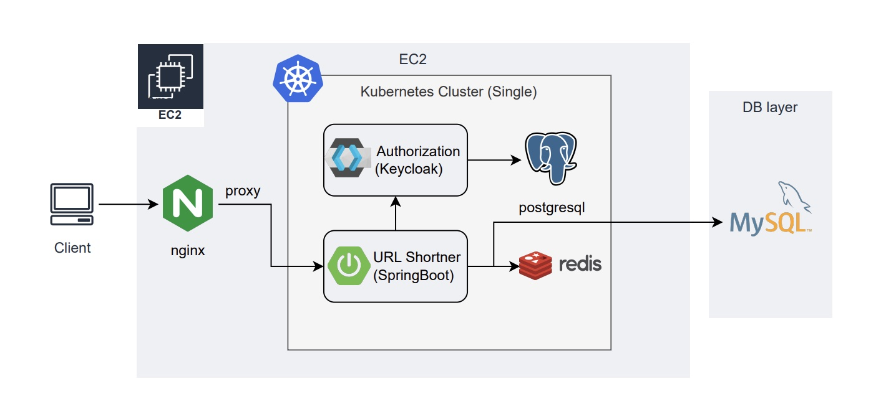

## URL-Shortener (단축 URL 생성 서비스)
단축 URL을 생성하고, 방문자 정보(브라우저, 위치, 언어, 시간)를 수집합니다.
### 배포 URL 및 데모 영상
배포 주소: http://43.200.64.114  
[데모 영상 보기](doc/demo_video.md)
### 아키텍처 그림

### 사용 기술 및 개발 환경
* Kubernetes Single Node Cluster (EC2)
  * 비용절감을 위해 EKS가 아닌 EC2에 직접 kubernetes 클러스터 구성 
* SpringBoot - URL Shortener 서비스  
* Keycloak - 인증서버
* nginx - 프록시
  * [nginx 도입 이유](doc/nginx.md)
* Mysql
* Redis
* Postgresql
* geoip - 위치 정보 오픈 소스 데이터베이스
### 연결문서
* [EC2 k8s 클러스터 구성](doc/kubernetes.md)
* [keycloak set-up 과정](doc/keycloak.md)
* [단축 URL 생성 알고리즘](doc/short-url-algorithm.md)
* [엔터티 DDL](doc/ddl.md)