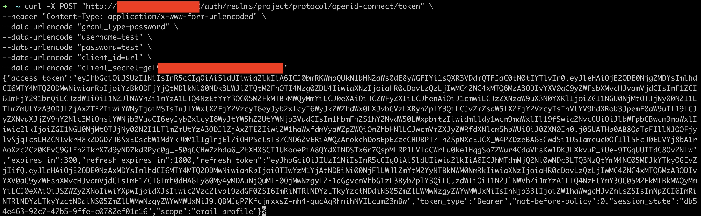

## keycloak set-up (helm install)
keycloak 설치를 위해 helm을 이용하였으며, realm 및 client 설정 과정에 대한 기록입니다.
### 1. 설치 (helm)
```
helm repo add codecentric https://codecentric.github.io/helm-charts

# values.yaml 작성
extraEnv: |
  - name: KEYCLOAK_USER
    value: <admin-id>
  - name: KEYCLOAK_PASSWORD
    value: <admin-password>

helm install keycloak codecentric/keycloak -f values.yaml
```

### 2. 설정
#### 1. "project" realm 생성 및 "url" client 생성 

#### 2. "url" client confidential 설정

#### 3. "client secret" 확인 및 curl을 이용해 로그인 테스트
